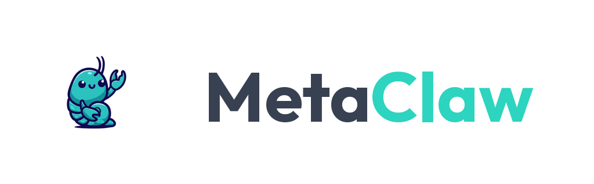

<p align="center">
  
</p>

<p align="center">
  An open-source AI Chief of Staff framework — Claude agents running in isolated containers, controlled from your phone.
</p>

<p align="center">
  <a href="https://github.com/charles-adedotun/metaclaw/stargazers"></a>
  <a href="https://github.com/charles-adedotun/metaclaw/blob/main/LICENSE"></a>
  <a href="https://github.com/charles-adedotun/metaclaw/actions"></a>
</p>

## What is MetaClaw

MetaClaw is an AI Chief of Staff (CoS) framework. It runs Claude agents in isolated Linux containers, orchestrated by a single Node.js process, and controlled from your phone via WhatsApp, Telegram, or other messaging channels.

Think of it as a personal assistant that schedules tasks, manages group contexts, handles recurring work, and executes complex operations — all through the messaging apps you already use. Each agent runs in its own container with filesystem isolation, so you get real security without sacrificing capability.

The entire codebase is small enough to read, understand, and customize in an afternoon.

## Why MetaClaw

[OpenClaw](https://github.com/openclaw/openclaw) is an impressive project with broad community support. But it comes with nearly half a million lines of code, 53 configuration files, and 70+ dependencies. Its security model operates at the application level — allowlists, pairing codes, permission checks — with everything running in a single process with shared memory.

MetaClaw provides the same core functionality with a fundamentally different approach:

| | OpenClaw | MetaClaw |
|---|---|---|
| **Codebase** | ~500k LOC | Small enough to read |
| **Config files** | 53 | 0 (modify the code) |
| **Dependencies** | 70+ | Minimal |
| **Security model** | Application-level (allowlists, permission checks) | OS-level (container isolation) |
| **Agent isolation** | Shared process memory | Separate Linux containers |
| **Customization** | Configuration | Code changes via Claude Code |

MetaClaw is for users who want to understand what they're running and trust the isolation model it uses.

## Quick Start

```bash
git clone https://github.com/charles-adedotun/metaclaw.git
cd metaclaw
claude
```

Then run `/setup`. Claude Code handles dependencies, authentication, container setup, and service configuration.

## Features

- **Multi-channel messaging** — WhatsApp, Telegram, Discord, Slack, Signal, or headless operation
- **Container-isolated agents** — each agent runs in Docker or Apple Container with OS-level sandboxing
- **Per-group memory and filesystem isolation** — every group gets its own `CLAUDE.md`, workspace, and container
- **Scheduled tasks** — cron, interval, or one-shot jobs that run agents and report back
- **Agent Swarms** — teams of specialized agents that collaborate on complex tasks within your chats
- **Web access and file handling** — search the web, process uploads, generate documents
- **Extensible via Claude Code skills** — add capabilities with `/add-telegram`, `/add-gmail`, and more

## How It Works

```
WhatsApp (Baileys) → SQLite → Polling loop → Container (Claude Agent SDK) → Response
```

A single Node.js process connects to your messaging channels, stores incoming messages in SQLite, and dispatches them to Claude agents running inside isolated Linux containers. Agents communicate back to the host via an IPC filesystem protocol. Each group's container only sees its own mounted directories — nothing else.

**Key files:**

| File | Purpose |
|------|---------|
| `src/index.ts` | Orchestrator: state, message loop, agent invocation |
| `src/channels/whatsapp.ts` | WhatsApp connection, auth, send/receive |
| `src/channels/telegram.ts` | Telegram connection via grammy |
| `src/ipc.ts` | IPC watcher and task processing |
| `src/router.ts` | Message formatting and outbound routing |
| `src/group-queue.ts` | Per-group queue with global concurrency limit |
| `src/container-runner.ts` | Spawns streaming agent containers |
| `src/task-scheduler.ts` | Runs scheduled tasks |
| `src/db.ts` | SQLite operations (messages, groups, sessions, state) |
| `groups/*/CLAUDE.md` | Per-group memory and instructions |

## Usage Examples

Talk to your assistant using the configured trigger word (e.g., `@Assistant`):

```
@Assistant every weekday at 9am, summarize my unread emails and message me a briefing
@Assistant review the git history weekly and flag anything unusual
@Assistant compile top Hacker News stories each morning and send me a digest
```

From the main channel (your self-chat), manage groups and tasks:

```
@Assistant list all scheduled tasks across groups
@Assistant pause the morning briefing task
@Assistant join the "Project Alpha" group
```

The trigger word, assistant name, and behavior are all configurable — just tell Claude Code what you want.

## Customization

No config files. Modify the code.

The codebase is small enough that Claude Code can safely make changes. Just describe what you want:

- "Change the trigger word to @Jarvis"
- "Make responses shorter and more direct"
- "Add a custom greeting when I say good morning"
- "Store conversation summaries weekly"

Or run `/customize` for guided changes.

## Contributing

**Skills over features.**

Instead of adding features directly to the codebase, contributors submit [Claude Code skills](https://code.claude.com/docs/en/skills) — markdown files that teach Claude Code how to transform a MetaClaw installation. Users run the skill on their fork and get clean code that does exactly what they need.

See [CONTRIBUTING.md](CONTRIBUTING.md) for guidelines.

### Request for Skills (RFS)

Skills the community would like to see:

**Communication Channels**
- `/add-slack` — Slack integration

**Session Management**
- `/clear` — Conversation compaction (summarize context while preserving critical information)

## Requirements

- macOS or Linux
- Node.js 20+
- [Claude Code](https://claude.ai/download)
- [Docker](https://docker.com/products/docker-desktop) (default) or [Apple Container](https://github.com/apple/container) (macOS, via `/convert-to-apple-container`)

## FAQ

**Why Docker?**
Docker provides cross-platform support (macOS, Linux, Windows via WSL2) and a mature ecosystem. On macOS, you can switch to Apple Container via `/convert-to-apple-container` for a lighter-weight native runtime.

**Can I run this on Linux?**
Yes. Docker is the default runtime and works on both macOS and Linux. Just run `/setup`.

**Is this secure?**
Agents run in containers, not behind application-level permission checks. They can only access explicitly mounted directories. The codebase is small enough that you can audit it yourself. See [docs/SECURITY.md](docs/SECURITY.md) for the full security model.

**Why no configuration files?**
Every user should customize MetaClaw so the code does exactly what they want, rather than configuring a generic system. If you prefer config files, tell Claude Code to add them.

**How do I debug issues?**
Ask Claude Code. "Why isn't the scheduler running?" "What's in the recent logs?" "Why did this message not get a response?" The AI-native approach means Claude Code is your debugger.

**Why isn't setup working?**
During setup, Claude Code will try to dynamically fix issues. If that doesn't work, run `claude` then `/debug`. If Claude finds an issue likely affecting other users, open a PR to improve the setup skill.

**What changes are accepted to the base codebase?**
Security fixes, bug fixes, and clear simplifications only. Everything else — new capabilities, OS compatibility, enhancements — should be contributed as skills. This keeps the base system minimal.

## Security

See [docs/SECURITY.md](docs/SECURITY.md) for the full security model, container isolation details, and threat analysis.

## License

MIT
