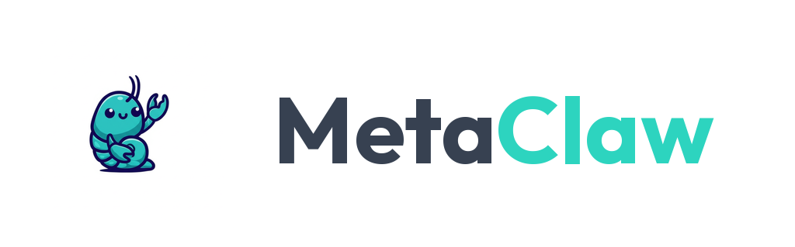
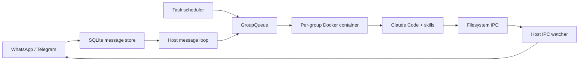

<p align="center">
  
</p>

# MetaClaw

<p align="center">
  A Node.js orchestrator that routes WhatsApp and Telegram messages to Claude agents running in isolated Docker containers.
</p>

<p align="center">
  <a href="https://github.com/charles-adedotun/metaclaw/stargazers"></a>
  <a href="https://github.com/charles-adedotun/metaclaw/blob/main/LICENSE"></a>
  <a href="https://github.com/charles-adedotun/metaclaw/actions"></a>
</p>

## What It Is

MetaClaw is a single Node.js process that bridges messaging channels (WhatsApp, Telegram) to Claude Code running inside per-group Docker containers. Each registered group — a "Chief of Staff", a Researcher, an Engineer — gets its own container with isolated filesystem, session state, and a system prompt defined in a plain Markdown file. Agents respond to chat messages, execute cron-scheduled tasks, and communicate back to the host through a small filesystem IPC protocol.

The value proposition is simple: give chat-based agents useful tools, persistent memory, and scheduled work, while keeping their shell access behind Docker instead of your host machine. The codebase is deliberately small (~30 TypeScript source files) so the operator can read and own the whole thing.

## Proof You Can Run

For a fast source-level check:

```bash
npm install
npm run typecheck
npm test
```

What this proves: the TypeScript host process compiles, and the Vitest suite exercises routing, queueing, IPC authorization, scheduler behavior, container timeout handling, and container-runtime command construction.

For a container-boundary check:

```bash
./container/build.sh
docker run --rm --entrypoint sh metaclaw-agent:latest -lc 'id -un && pwd'
docker run --rm --entrypoint sh -v "$PWD:/workspace/project:ro" metaclaw-agent:latest -lc 'touch /workspace/project/.metaclaw-write-test 2>/dev/null || echo project-read-only'
```

Expected output: the first Docker command prints `node` and `/workspace/group`, showing the image runs as the non-root container user in the group workspace. The second command prints `project-read-only`, matching the main-agent mount policy in `src/container-runner.ts`: the project root is mounted read-only, while writable state is limited to explicit group, IPC, upload, session, and allowlisted extra mounts.

## Architecture


```mermaid
flowchart LR
  chat["WhatsApp / Telegram"] --> db["SQLite message store"]
  db --> loop["Host message loop"]
  scheduler["Task scheduler"] --> runner["GroupQueue"]
  loop --> runner
  runner --> container["Per-group Docker container"]
  container --> claude["Claude Code + skills"]
  claude --> ipc["Filesystem IPC"]
  ipc --> host["Host IPC watcher"]
  host --> chat
```

- **Host orchestrator** (`src/index.ts`) — polls SQLite for new messages every 2 s, manages container lifecycle via `GroupQueue`, runs the IPC watcher and task scheduler in parallel loops.
- **Per-group containers** — each group gets a separate Docker container running Claude Code via the `agent-runner` wrapper. Volume mounts are explicit and narrow: group workspace, IPC directory, uploads, and Claude session state.
- **Filesystem IPC** — agents write JSON command files to `/workspace/ipc/messages/`. The host polls every 1 s and acts on `send_message`, `send_file`, `register_group`, `schedule_task`, and related commands.
- **Skills** (`skills/`) — Claude Code skill definitions mounted read-only into every container. Built-in skills handle browser automation, document creation (PDF, DOCX, XLSX, PPTX), and file management. `/setup`, `/customize`, `/debug`, and `/update` skills handle the full operator workflow.
- **Task scheduler** — SQLite-backed cron, interval, and one-shot tasks. Each task fires a container invocation with either a fresh or continuous Claude session.
- **Mount security** — extra volume mounts are validated against an allowlist at `~/.config/metaclaw/mount-allowlist.json` before any container starts.

## Quickstart

Requirements: Node.js 20+, Docker, Claude Code (the `claude` CLI).

```bash
git clone https://github.com/charles-adedotun/metaclaw.git
cd metaclaw
cp .env.example .env          # set ASSISTANT_NAME, and TELEGRAM_BOT_TOKEN if using Telegram
npm install
claude                         # open Claude Code in the project root
```

Inside Claude Code, run the setup skill:

```
/setup
```

The setup skill builds the container image, configures your channel, and installs the system service (launchd on macOS, systemd on Linux).

For subsequent development:

```bash
npm run dev        # run with hot reload, no compile step
npm run typecheck  # type-check without emitting
npm test           # run all tests (vitest)
./container/build.sh  # rebuild the agent container image
```

## Why This Exists

The typical multi-agent framework ends up as a configuration maze: multiple processes, overlapping permission layers, integrations no one asked for, and a codebase too large to audit confidently. MetaClaw is the opposite: one process, one database, containers as the security boundary instead of application-level permission checks. Bash is safe because it runs inside the container, not on your machine.

Non-goals:
- **Not a hosted platform.** This is self-hosted, single-operator software.
- **Not a multi-tenant service.** No auth layer, no user management — you are the only operator.
- **Not a configuration-driven framework.** If you want different behavior, change the TypeScript. The codebase is small enough that this is practical.

New integrations are contributed as Claude Code skills (e.g. `/add-telegram`, `/add-discord`, `/convert-to-apple-container`) that transform the codebase on install, rather than adding runtime feature flags.

## Status

Active development. The core orchestrator, container isolation, IPC protocol, and task scheduler are stable. The skills API and group configuration format may change between versions. Not recommended for production multi-user deployments.

## License

[MIT](LICENSE)
